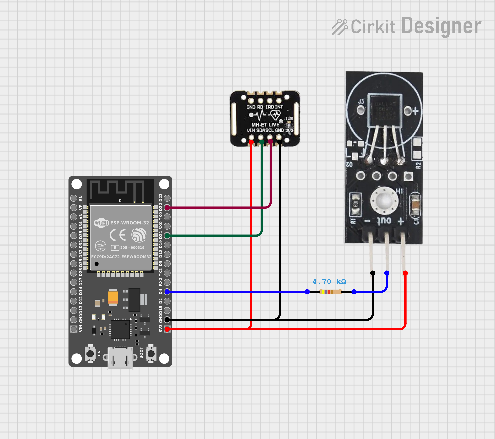
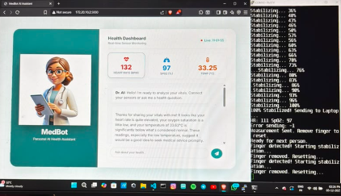
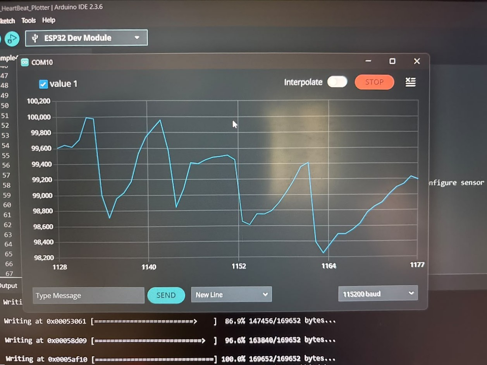
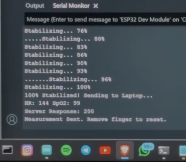
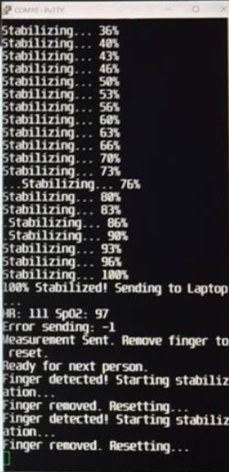

# 🩺 MedBot AI


An AI-powered IoT healthcare monitoring system that combines **ESP32**, **MAX30102**, **DS18B20**, **Flask**, and **Google Gemini AI** to collect real-time vital signs, display them through an interactive web dashboard, and provide AI-assisted wellness insights.

> **Disclaimer:** MedBot AI is an educational prototype developed for learning and demonstration purposes. It is **not** intended to provide medical diagnoses or replace professional healthcare advice.

---

## 🚀 Features

- 📡 Real-time monitoring of Heart Rate, SpO₂, and Body Temperature
- 🌐 Live web dashboard built with Flask
- 🤖 AI-assisted wellness insights using Google Gemini
- 💬 Interactive chat interface for health-related queries
- 📶 ESP32 sends sensor data over Wi-Fi using REST APIs
- ⚡ Automatic live updates without refreshing the webpage
- 🔒 Built-in disclaimer for responsible AI usage

---

## 🛠 Hardware Components

| Component | Purpose |
|-----------|---------|
| ESP32 | Main microcontroller responsible for data acquisition and Wi-Fi communication |
| MAX30102 | Measures Heart Rate (BPM) and Blood Oxygen Saturation (SpO₂) |
| DS18B20 | Measures body temperature |
| Wi-Fi | Transmits sensor data to the Flask server over the local network |

---

## 💻 Software Stack

| Technology | Usage |
|------------|-------|
| Python | Backend development |
| Flask | Web server and REST API |
| HTML5 | User Interface |
| CSS3 | Dashboard styling |
| JavaScript | Live updates and AI interaction |
| Google Gemini API | AI-powered wellness consultation |
| Arduino IDE | ESP32 firmware development |

---

## 🏗️ System Architecture

The MedBot AI system follows an end-to-end IoT architecture where physiological data is collected using sensors connected to an ESP32 microcontroller. The ESP32 transmits the sensor readings to a Flask backend over Wi-Fi. The backend updates the live dashboard and forwards the data to Google Gemini AI to generate general wellness insights and answer user health queries.

```text
                    ┌─────────────────────┐
                    │      Patient        │
                    └──────────┬──────────┘
                               │
              ┌────────────────┴────────────────┐
              │                                 │
      MAX30102 Sensor                  DS18B20 Sensor
 (Heart Rate & SpO₂)                 (Temperature)
              │                                 │
              └────────────────┬────────────────┘
                               │
                            ESP32
                     (Data Acquisition)
                               │
                         Wi-Fi (HTTP)
                               │
                               ▼
                     Flask Backend Server
                               │
              ┌────────────────┴────────────────┐
              │                                 │
      Live Dashboard                 Google Gemini AI
              │                                 │
              └────────────────┬────────────────┘
                               │
                               ▼
                 AI Health Consultation
```

---

## ⚙️ Project Workflow

1. **User places a finger** on the MAX30102 sensor while the DS18B20 measures body temperature.
2. **ESP32 acquires the sensor data** and filters the readings to obtain stable Heart Rate and SpO₂ values.
3. **Validated health data** is packaged into a JSON payload.
4. **ESP32 sends the data** to the Flask backend over Wi-Fi using an HTTP POST request.
5. **Flask server receives and stores** the latest vital signs.
6. **Live dashboard updates automatically** to display the new readings without refreshing the page.
7. **Google Gemini AI analyzes** the received vitals and generates a general wellness summary.
8. **Users can ask additional health-related questions** through the chat interface, where Gemini responds using the latest vitals as context.
9. **MedBot AI displays the AI response** while reminding users that the system is intended for educational purposes only.

---

## 📂 Project Structure

```text
MedBot-AI/
│
├── backend/
│   ├── health_server.py          # Flask backend
│   │
│   ├── templates/
│   │   └── index.html            # Dashboard UI
│   │
│   └── static/
│       ├── style.css             # Dashboard styling
│       ├── script.js             # Frontend logic
│       └── avatar.jpg            # MedBot avatar
│
├── firmware/
│   └── esp_architecture_medbot/
│       └── esp_architecture_medbot.ino
│
├── assets/                       # Screenshots, diagrams & demo GIF
├── docs/                         # Additional documentation
│
├── README.md
├── requirements.txt
├── .gitignore
├── LICENSE
└── .env.example
```

---

## 🚀 Installation

### 1. Clone the repository

```bash
git clone https://github.com/indrajithberlin/MedBot-AI.git
cd MedBot-AI
```

### 2. Install dependencies

```bash
pip install -r requirements.txt
```

### 3. Configure the backend

Create a `.env` file or update your API key configuration.

```env
GEMINI_API_KEY=YOUR_API_KEY
```

### 4. Upload the firmware

- Open the firmware in Arduino IDE.
- Update the Wi-Fi credentials.
- Set the Flask server IP address.
- Upload the sketch to the ESP32.

### 5. Start the backend

```bash
cd backend
python health_server.py
```

Open:

```
http://127.0.0.1:5000
```

---

## 📸 Project Preview

### Hardware Circuit

The hardware setup consists of an ESP32 DevKit connected to a MAX30102 pulse oximeter sensor and a DS18B20 temperature sensor. Communication with the MAX30102 is established over the I²C interface, while the DS18B20 uses the OneWire protocol with a 4.7 kΩ pull-up resistor.

<p align="center">
  
</p>

---

### Dashboard Interface

<p align="center">
  
</p>

---

### Real-Time BPM Graph

<p align="center">
  
</p>

---

### Sensor Data Received by Flask

<p align="center">
  
</p>

---

### ESP32 Serial Monitor

<p align="center">
  
</p>

---

## 🌐 API Endpoints

| Method | Endpoint | Description |
|--------|----------|-------------|
| GET | `/` | Opens the MedBot AI dashboard |
| GET | `/data` | Returns the latest sensor readings in JSON format |
| POST | `/api/vitals` | Receives sensor data from the ESP32 |

---

## 🚀 Future Enhancements

- User authentication and health profiles
- Historical health data visualization
- Cloud database integration
- Medical report generation in PDF format
- Mobile application support
- Wearable device integration
- Emergency alert notifications
- Enhanced AI health recommendations

---

## 🛠 Technologies Used

- Python
- Flask
- ESP32
- MAX30102
- DS18B20
- HTML5
- CSS3
- JavaScript
- Google Gemini API
- Arduino IDE

---

## 🤝 Contributing

Contributions, suggestions, and feature requests are welcome.

If you'd like to improve MedBot AI:

1. Fork the repository.
2. Create a new feature branch.
3. Commit your changes.
4. Open a Pull Request.

---

## 📄 License

This project is licensed under the MIT License.

See the `LICENSE` file for more information.

---

## 👨‍💻 Author

**Indrajith Berlin**

Computer Science & Engineering (AI & ML)

- GitHub: https://github.com/indrajithberlin
- LinkedIn: https://www.linkedin.com/in/indrajith-berlin

---